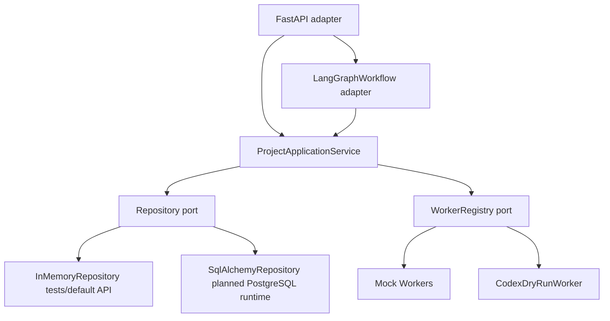

# Architecture Overview

## Scope

This stage implements a minimal two-layer AI organization workflow:

1. Control layer: project, task, approval, worker-run, review, status, audit, and
   workflow orchestration.
2. Execution layer: deterministic Mock Workers plus a Codex dry-run worker stub.

No real LLM, real Codex process, OpenHands runtime, or untrusted-code execution
is used in this stage.

## Module Layout

- `src/ai_org/domain`: framework-free dataclasses, enums, errors, and state
  transition guards.
- `src/ai_org/protocols`: Pydantic v2 request and response contracts.
- `src/ai_org/ports`: repository and worker interfaces.
- `src/ai_org/application`: project workflow use cases and response mapping.
- `src/ai_org/orchestration`: LangGraph adapter and checkpoint safety helpers.
- `src/ai_org/adapters/memory`: in-memory repository for deterministic tests.
- `src/ai_org/adapters/postgres`: SQLAlchemy models, repository, and UOW.
- `src/ai_org/adapters/workers`: Mock Worker and Codex dry-run implementations.
- `src/ai_org/adapters/api`: FastAPI application and error boundary.

## Runtime Flow

The API and LangGraph adapter call the application service. The domain layer does
not import LangGraph, FastAPI, SQLAlchemy, or Alembic.

## Implemented End-To-End Paths

- Low-risk task: create project, select ready task, dispatch Mock Worker, persist
  result, run deterministic validation, review independently, accept, finalize,
  audit.
- High-risk task: create project, request approval, LangGraph interrupt, persist
  approval, resume with approval decision, dispatch once, review, finalize.
- Approval rejection: block the task and project without dispatching a worker.
- Rework limit: review can request rework, attempts are bounded by `max_attempts`.
- Idempotency: repeated project run requests do not create duplicate WorkerRuns
  for an already completed task.

## Persistence Status

Business schema and repository code are implemented for PostgreSQL, and Alembic
migration `0001_initial_business_schema` defines the business tables. FastAPI
uses in-memory storage by default for key-free local tests, and switches to
PostgreSQL when `AI_ORG_DATABASE_URL` is set. PostgreSQL mode wires SQLAlchemy
commit/rollback hooks into the application service and uses a PostgreSQL
LangGraph checkpointer.

The local implementation machine did not have Docker installed, so live
PostgreSQL integration tests were skipped locally. The test itself now starts
Docker Compose, runs Alembic, interrupts, closes the business session, recreates
the service/workflow, and resumes from PostgreSQL checkpoint when Docker is
available.

## Adapter Isolation

LangGraph state is kept to primitive, serializable control fields. Third-party
runtime types do not cross into `domain` or public Pydantic protocols.
