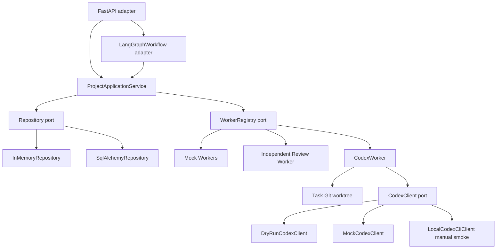

# Architecture Overview

## Scope

This repository implements a two-layer AI organization skeleton:

1. Control layer: project, task, approval, worker-run, review, status, audit,
   and LangGraph workflow orchestration.
2. Execution layer: deterministic Mock Workers plus a Codex Coding Worker
   adapter with Mock, DryRun, and explicitly opt-in local CLI smoke clients.

No default path calls a real LLM, starts a real Codex process, integrates
OpenHands, or executes user-provided untrusted code. The only real Codex path is
the manual smoke test guarded by `AI_ORG_ENABLE_REAL_CODEX_SMOKE=true`.

## Module Layout

- `src/ai_org/domain`: framework-free dataclasses, enums, errors, and transition
  guards.
- `src/ai_org/protocols`: Pydantic v2 request and response contracts.
- `src/ai_org/ports`: repository, worker, and Codex client interfaces.
- `src/ai_org/application`: project workflow use cases and response mapping.
- `src/ai_org/orchestration`: LangGraph adapter and checkpoint safety helpers.
- `src/ai_org/adapters/codex`: Codex Worker, Mock/DryRun/Local CLI clients,
  worktree service, policy, prompt renderer, diff collector, and log collector.
- `src/ai_org/adapters/workers`: deterministic workers, Review Worker, and
  default WorkerRegistry.
- `src/ai_org/adapters/postgres`: SQLAlchemy models, repository, and sessions.
- `src/ai_org/adapters/api`: FastAPI application and error boundary.

## Runtime Flow

## Implemented Paths

- Low-risk task: dispatch, persist result, validate, review, accept, finalize.
- High-risk task: interrupt for approval, persist approval/checkpoint, resume,
  dispatch once, review, finalize.
- Approval rejection: block task/project without dispatching a worker.
- Bounded rework: Review Worker can request rework until `max_attempts`.
- Idempotency: repeated run requests do not create duplicate WorkerRuns.
- Codex Mock/DryRun task: create task worktree, render constrained prompt, collect
  changed files/diff/log artifacts, persist structured AgentResult metadata, and
  require independent review.
- Codex local CLI smoke task: with explicit opt-in, detect Codex CLI, check
  summarized auth status, run `codex exec` in a task worktree with
  `workspace-write` sandbox and `on-request` approval, allow only `smoke/**`,
  collect sanitized artifacts, and require independent review.

## Persistence

Business schema migrations:

- `alembic/versions/0001_initial_business_schema.py`
- `alembic/versions/0002_add_task_metadata.py`

FastAPI uses in-memory storage by default and switches to PostgreSQL when
`AI_ORG_DATABASE_URL` is set. PostgreSQL checkpointing uses the separate
`langgraph_checkpoint` schema.

## Boundaries

The domain layer does not import LangGraph, FastAPI, SQLAlchemy, or Alembic.
Codex runtime details stay behind `CodexClient`; the domain sees only structured
task metadata and `AgentResult` payloads.
