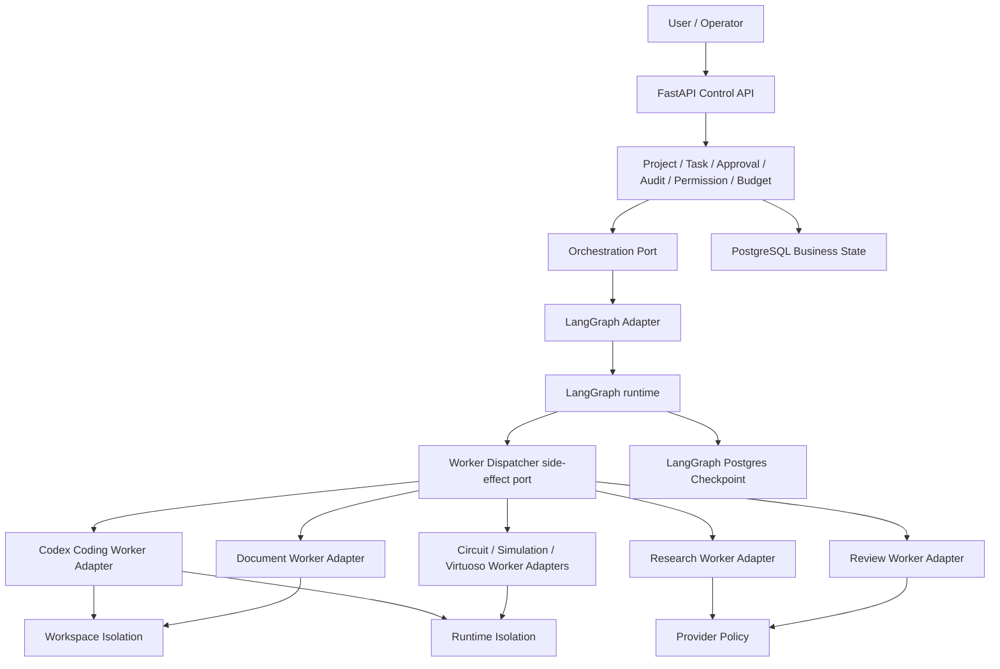

# 第三方依赖架构边界

核验日期：2026-07-01

## 总体结论

第一版使用 LangGraph 作为第一层 workflow、checkpoint、interrupt/resume 底座，但不把 LangGraph 的 state、node、message、tool 类型扩散到业务域。Project、Task、Approval、Audit、Permission、Budget、WorkerRun 是本项目自研领域层。

OpenHands、OpenAI Agents SDK、CrewAI、MetaGPT、Microsoft Agent Framework 不进入第一版核心依赖。未来如果引入，只能作为 Worker runtime 或替代编排底座的 Adapter 实现。

## 两层结构



WorkerRun 的实际发起只有一个入口：LangGraph node 通过 `Worker Dispatcher side-effect port` 调用 Worker Adapter。Domain 层可以创建任务、审批、权限和预算，也可以读取 WorkerRun 状态，但不能绕过 Orchestration/LangGraph 直接启动执行型 Worker。

## 第一层职责

第一层负责：

- 理解用户目标并创建 Project；
- 规划项目、拆解 Task；
- 调度 Worker；
- 管理状态、权限、预算；
- 触发人工审批；
- 审查和验收结果；
- 处理返工、失败恢复和重试；
- 写入完整审计日志。

第一层不负责：

- 直接运行不可信 shell；
- 直接修改业务仓库代码；
- 持有无边界 API key；
- 把任意第三方 agent 的内部 message/task 模型当成业务模型。

## 第二层职责

第二层是执行层，包含 Research、Coding、Document、Review、Circuit、Simulation、Virtuoso 等 Worker。每个 Worker 只能通过 Adapter 接收任务，返回结构化结果、证据、产物路径和审计摘要。

Codex 是第一版优先接入的 Coding Worker。Codex Adapter 必须：

- 使用任务级 Git worktree；
- 明确输入、输出、预算和权限；
- 捕获命令、文件变更、测试结果和失败原因；
- 由第一层决定是否提交、合并、返工或请求人工审批；
- 不让 Codex 直接绕过第一层写业务状态数据库。

## 内部接口草案

以下接口只是非规范示例，用来说明边界，不代表本阶段要实现完整业务代码，也不冻结后续 schema。

```python
from typing import Protocol
from pydantic import BaseModel


class WorkerPermissions(BaseModel):
    allow_network: bool = False
    allow_shell: bool = False
    allowed_paths: list[str] = []
    max_runtime_seconds: int
    max_cost_usd: float | None = None


class WorkerRequest(BaseModel):
    project_id: str
    task_id: str
    worker_kind: str
    objective: str
    inputs: dict
    permissions: WorkerPermissions


class WorkerResult(BaseModel):
    task_id: str
    status: str
    summary: str
    changed_paths: list[str] = []
    evidence: list[str] = []
    requires_approval: bool = False
    error: str | None = None


class WorkerAdapter(Protocol):
    async def run(self, request: WorkerRequest) -> WorkerResult:
        ...
```

正式 Worker 协议需要在第二阶段拆出 capability profile，而不是只依赖 `inputs: dict`。至少应包含 artifact manifest、secret refs、sandbox profile、retry/idempotency、cancel/resume、resource lease 和 telemetry policy。

## Adapter 边界

### LangGraph Adapter

LangGraph 只存在于 orchestration adapter 内部：

- 将内部 Project/Task 状态映射为 LangGraph state；
- 将 ApprovalGate 映射为 LangGraph interrupt；
- 将 checkpoint 存入 PostgreSQL；
- 将 worker dispatch 映射为 graph node，并由该 node 调用唯一的 Worker Dispatcher side-effect port；
- 将 graph 运行结果写回业务状态库。

禁止事项：

- 禁止在业务层直接 import LangGraph 类型；
- 禁止把 LangGraph checkpoint 当作唯一业务状态；
- 禁止在 LangGraph node 内直接执行不受限 shell；
- 禁止让模型输出直接决定权限升级。

### Worker Adapter

所有 Worker 使用相同 Adapter 形状：

- 输入：任务目标、上下文、权限、预算、工作目录；
- 输出：状态、结构化结果、证据、产物、审计摘要；
- 失败：明确 error class、可重试性、需要人工介入的原因；
- 审批：任何越权操作返回 `requires_approval=true`，由第一层创建 Approval。

### 可选 Runtime Adapter

OpenAI Agents SDK、OpenHands、CrewAI、Microsoft Agent Framework 若未来引入，必须包在 `WorkerAdapter` 或新的 `OrchestrationAdapter` 后面。第三方 runtime 的 session、message、tool、crew、agent、workflow 等类型不能成为跨模块公共协议。

## 状态与持久化

PostgreSQL 保存两类状态：

1. 业务状态：Project、Task、Approval、Audit、Permission、Budget、WorkerRun；
2. LangGraph checkpoint：仅用于 workflow 恢复和中断恢复。

业务状态是权威来源。LangGraph checkpoint 是可恢复执行上下文，不承载权限最终事实。恢复 workflow 时必须重新读取当前权限、预算和审批状态，防止过期 checkpoint 绕过新策略。

checkpoint 数据必须按敏感数据处理：

- 设置 `LANGGRAPH_STRICT_MSGPACK=true`，或在创建 checkpointer 时传入显式 `allowed_msgpack_modules` allowlist；
- checkpoint 使用独立 PostgreSQL schema 和最小权限 DB role；
- 禁止保存 API key、访问 token、原始密钥、完整 env dump 和不必要的原始 prompt；
- 对可能包含用户代码、模型输出或工具结果的字段分级，并定义保留期限；
- 对数据库、备份和审计导出执行加密和访问控制；
- 设置 checkpoint TTL 或清理任务；
- 启动时自检 strict msgpack、DB role、schema、加密和 TTL 配置；
- 恢复前校验 project/task/approval/worker_run 关联和幂等键。

## 人工审批

审批必须由领域层创建和审计。LangGraph interrupt 只负责暂停和恢复控制流。

审批触发条件包括：

- 需要更高 shell、网络、文件或凭据权限；
- 预算超限或接近阈值；
- 将生成代码写入受保护分支；
- 使用 OpenHands 或其他高风险执行 runtime；
- 访问用户未授权的目录、仓库、外部系统；
- 需要提交、推送、部署或产生费用。

## 权限与预算

权限模型默认拒绝：

- shell 默认关闭；
- 网络默认关闭；
- 文件系统只允许任务 worktree 和临时目录；
- API key 只通过短期、最小权限环境注入；
- API key 不得进入 checkpoint、audit 原文、trace、env dump 或 worker 产物；
- 失败任务清理临时凭据缓存，并支持密钥轮换和吊销；
- Docker 容器不挂载宿主 Docker socket；
- 不使用特权容器；
- Worker 不直接持有全局数据库写权限。

预算模型按 project、task、worker、provider 记录，包含 token、API 成本、运行时长、外部服务费用和人工审批阈值。

## 执行隔离

Git worktree 是工作区隔离，不是安全边界。Docker、远程沙箱、权限系统和审批策略才承担安全边界。Coding、Simulation、Virtuoso 等高风险 worker 必须使用隔离策略：

- 每个任务独立 Git worktree；
- 每个任务独立 Docker 容器或远程隔离环境；
- 固定镜像 digest；
- 只挂载任务目录；
- 运行用户非 root；
- 限制 CPU、内存、网络、进程数和运行时间；
- `cap-drop=ALL`，禁用 privileged；
- 默认只读 rootfs，临时目录显式挂载；
- 启用 seccomp/AppArmor 或平台等价策略；
- 禁止 host PID、host IPC、host network；
- 默认无网络，确需网络时使用 egress allowlist；
- 禁止挂载 SSH agent、Git 凭据、云凭据和宿主 Docker socket；
- 对镜像来源、签名或 digest 做校验；
- 输出产物先进入 staging，再由第一层验收；
- 删除容器前保存审计日志、命令记录和必要产物。

强制矩阵：

| 操作类型 | 隔离要求 |
| --- | --- |
| 纯规划、任务拆解、dry-run、diff 汇总 | 可不进入 Docker，但必须经过权限检查和审计 |
| 读取允许路径内的源码 | 使用任务 worktree，所有路径做 realpath 校验 |
| 运行测试、build、formatter、linter、用户代码或 shell | 必须进入 Docker 或远程沙箱 |
| 访问网络、下载依赖、调用外部工具 | 默认拒绝；审批后在沙箱内按 allowlist 开放 |
| Simulation/Virtuoso/EDA 任务 | 必须使用远程受控环境或容器，并记录资源 lease |

worktree 控制：

- 禁用或隔离 Git hooks；
- 默认禁用 submodule 和 LFS，确需启用需审批；
- 禁用或审查 clean/smudge filter；
- 所有写入路径做 realpath 校验，防止 symlink/path traversal；
- 合并前扫描 diff、权限位、二进制文件和大文件；
- 防止跨 worktree ref 污染和共享 object store 误用。

Provider 和遥测边界：

- 默认关闭第三方 runtime 的外发 tracing/telemetry；
- 私有仓库内容、用户 prompt、代码片段或 trace 发送到外部模型/provider 前需要策略授权；
- 日志、trace、错误报告必须脱敏；
- 记录 provider 的数据保留、训练使用、地域和删除策略；
- 不允许 Worker 自行开启新的 provider 或 telemetry sink。

## 依赖接入顺序

第二阶段建议只实现骨架：

1. Python 3.12 项目结构；
2. FastAPI health/control skeleton；
3. Pydantic 内部 DTO；
4. PostgreSQL schema 草案和 migration 工具；
5. LangGraph Adapter 最小 happy path；
6. Approval interrupt/resume spike；
7. Codex Adapter 接口和 dry-run 实现；
8. Git worktree + Docker sandbox spike。

暂不做：安装所有候选 agent 框架、接入真实 API key、运行产生费用的 provider、接入 OpenHands、实现完整业务功能。

## 替换策略

若未来替换 LangGraph，迁移面应限定为 `OrchestrationPort` 实现、checkpoint/resume 映射、workflow DSL、graph node 到 worker dispatch 的适配、测试和迁移脚本。

业务域、审批、审计、权限、预算和 Worker Adapter 不应被替换框架影响。实际迁移仍必须处理 in-flight workflow、历史 checkpoint 保留或清理、审批 token、WorkerRun 关联、幂等键、审计回放、双跑验证、迁移窗口和回滚策略。

## 关键风险与控制

| 风险 | 控制 |
| --- | --- |
| 第三方编排框架侵入业务模型 | Adapter 隔离，业务层禁止 import 第三方类型 |
| checkpoint 恢复绕过审批 | 恢复时重新读取业务权限、预算、审批状态 |
| checkpoint 反序列化导致代码执行 | `LANGGRAPH_STRICT_MSGPACK=true` 或 allowlist，独立 schema/role，启动自检 |
| Worker 获得不受限 shell | 默认拒绝，任务级审批，Docker/worktree 隔离 |
| OpenHands enterprise 目录误用 | 许可证扫描排除 `enterprise/`，不复制第三方源码 |
| API key 泄漏 | 短期凭据、环境注入、日志脱敏、无明文写盘、禁止进入 checkpoint/audit/env dump |
| 多框架状态语义冲突 | 第一版只采用 LangGraph 一个编排底座 |
| 供应链漏洞 | 锁版本、SBOM、pip-audit、Dependabot/Renovate、镜像扫描 |
